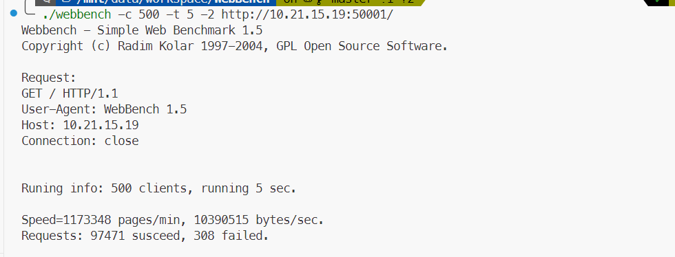

# CJJ-WebSever

## 目录

[风格描述](#风格描述)  
[基本组件](#基本组件)  
[环境配置](#环境配置)  
[Get start](#get-start)  
[docker部署](#docker-部署)  
[开发日志](#开发日志)

## 风格描述

目前的c++代码风格是偏向于C语言风格，较多使用POSIX接口

## 基本组件

- 线程同步包装类.
- 数据库连接池.
- 线程池.
- 定时器.
- 日志系统.
- http请求处理器.
- 注册登陆主件.
- 服务器配置类.
- 单元测试套件.

## 环境配置

- 编译工具链安装
  ```shell
  sudo apt-get install cmake
  ```

- 数据库配置验证
  - [MySQL数据库安装](https://github.com/cuijunjie18/my_notebook/blob/master/mysql)  

  运行服务器前配置webdev
  ```shell
  # 进入root
  mysql
  create database user_info_db; # 创建数据库
  create user 'webdev'@'localhost' identified by   '12345678'; # 创建webdev用户
  grant all privileges on user_info_db.* to   webdev@localhost; # 赋予权限
  flush privileges;
  exit; # 退出
  
  # 进入webdev
  mysql -h localhost -u webdev -p
  use user_info_db;
  
  # 创建user表
  USE user_info_db;
  CREATE TABLE user(
      username char(50) NULL,
      passwd char(50) NULL
  )ENGINE=InnoDB;
  
  # 插入第一个测试数据
  INSERT INTO user(username, passwd) VALUES('manager','1234');
  ```

## Get start

- clone本仓库
  ```shell
  git clone https://github.com/cuijunjie18/CJJ_webserver.git
  ```

- 编译
  ```shell
  cd CJJ_webserver
  make clean && make build
  ```

- 单元测试编译
  ```shell
  make clean && ENABLE_UT_TEST=ON make build
  ```  

- 运行
  ```shell
  ./bin/main
  ```
  可以在根目录产生的日志查看服务器运行端口

- 浏览器访问
  ```vim
  ip:port
  ```

## 开发日志

[开发日志](develop_log.md)  

## Docker 部署

项目现已支持Docker容器化部署！

- 使用docker-compose一键启动
```bash
# 使用docker-compose一键启动（包含MySQL数据库）
docker-compose up -d

# 访问服务
# 浏览器打开 ip:50001
```

详细的Docker部署说明请参考：[Docker部署指南](DOCKER_README.md)

## 压力测试

目前的压力测试结果：

  

## 后续规划

- [ ] 完善单元测试
- [x] 完成压力测试
- [ ] 提高webserver的并发度
- [ ] 支持个性化启动服务器
- [x] 支持docker启动

## 收获

[线程同步](src/lock/readme.md)  
[数据库连接池](src/CGImysql/readme.md)  
[i/o多路复用](learning/Multiplexing/readme.md)  
[事件触发模式](learning/trigger_mode/readme.md)  
[事件处理模式](learning/Event_handler_mode/readme.md)  
[c++模板实现线程池](src/threadpool/readme.md)  
[日志类实现](src/log/readme.md)  
[定时器](src/timer/readme.md)  
[c++语法基础](learning/cpp_base/readme.md)  
[参考代码](reference/readme.md)  

## 参考

baseline: https://github.com/qinguoyi/TinyWebServer.git  
mysql_cmake: https://github.com/nryeng/hello-mysql-world  
GTest: https://zhuanlan.zhihu.com/p/693222066
