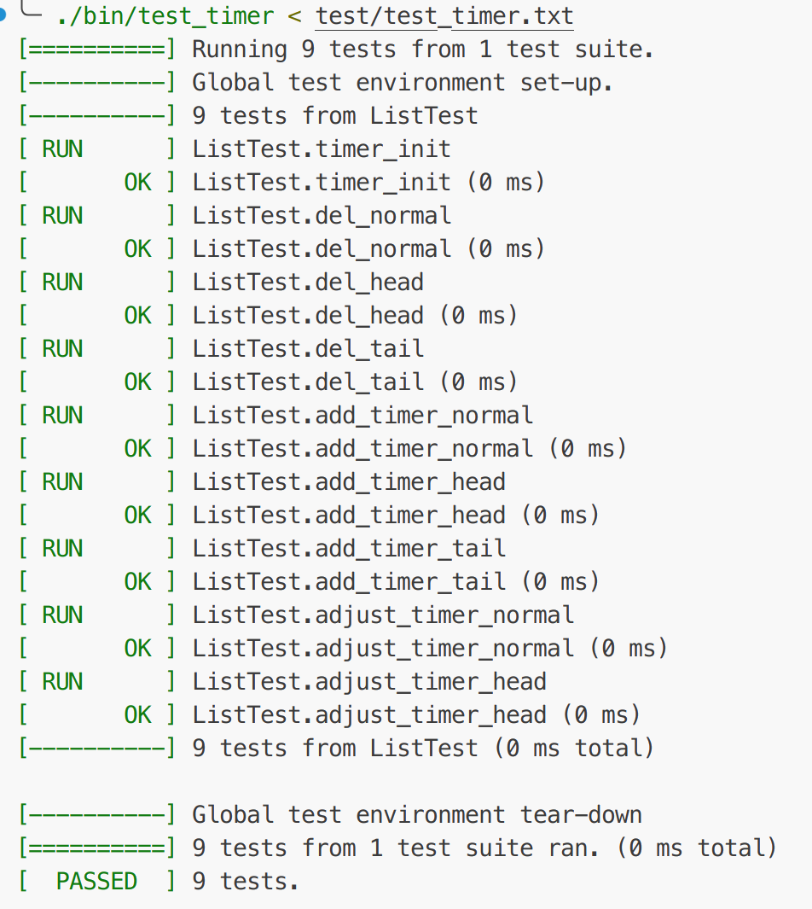

# CJJ-WebSever

## 风格描述

目前的c++代码风格是偏向于C语言风格，较多使用POSIX接口

## 基本组件

- 线程同步包装类.
- 数据库连接池.
- 线程池.
- 定时器.
- 日志系统.
- http请求处理器.
- 注册登陆主件.
- 测试组件(预想)

## 环境配置

- 数据库配置验证
  - [MySQL数据库安装](https://github.com/cuijunjie18/my_notebook/blob/master/mysql)  

  运行服务器前配置webdev
  ```shell
  # 进入root
  mysql
  create database user_info_db; # 创建数据库
  create user 'webdev'@'localhost' identified by   '12345678'; # 创建webdev用户
  grant all privileges on user_info_db.* to   webdev@localhost; # 赋予权限
  flush privileges;
  exit; # 退出
  
  # 进入webdev
  mysql -h localhost -u webdev -p
  use user_info_db;
  
  # 创建user表
  USE user_info_db;
  CREATE TABLE user(
      username char(50) NULL,
      passwd char(50) NULL
  )ENGINE=InnoDB;
  
  # 插入第一个测试数据
  INSERT INTO user(username, passwd) VALUES('manager','1234');
  ```

## 开发日志

- 2025.8.29
  - 完成线程同步机制的包装类，即lock功能包.
  - 初步搭建数据库连接池.(未实现具体函数)
  
- 2025.8.31
  - 完成数据库连接池搭建.(未添加日志系统、未测试)
  - 加上数据库连接池到main，测试编译成功.
  
- 2025.9.1
  - 完成线程池的搭建(未测试，大部分是copy from reference)
  - 学习i/o多路复用的相关理论，了解LT、ET事件触发模式.
  
- 2025.9.6
  - 修复线程池的实现，通过编译，检查线程数量符合预期.
  - 完成日志系统中阻塞队列编写，未测试.
  - 完成整个日志系统的开发，未测试.
- 2025.9.7
  - 日志系统编译、测试通过.
- 2025.9.9
  - 定时器组件编写完成.
  - 定时器添加了gtest,完成测试.如下
    

- 2025.9.10
  - 修改部分代码规范，包括区分用户头文件与系统头文件.
  - 创建全流程的代码(未编写).

- 2025.11.5
  - 添加部分c++学习笔记
  - 添加一些枚举类型代替常量，添加http代码框架，待TODO

- 2025.11.6
  - 记录一些有意义、优美的参考代码，在reference/下

- 2025.11.10
  - 添加一些c++文件操作相关内容

- 2025.11.13
  - 整改当前的目录结构，将include与src合并，增强阅读体验
  - 添加build.sh中-DENABLE_UT_TEST=OFF，是否指定测试
  - 添加部分测试用例

- 2025.11.17
  - 修复logger，添加对应的测试用例

## 收获

[线程同步](src/lock/readme.md)  
[数据库连接池](src/CGImysql/readme.md)  
[i/o多路复用](learning/Multiplexing/readme.md)  
[事件触发模式](learning/trigger_mode/readme.md)  
[c++模板实现线程池](src/threadpool/readme.md)  
[日志类实现](src/log/readme.md)  
[定时器](src/timer/readme.md)  
[c++语法基础](learning/cpp_base/readme.md)  
[参考代码](reference/readme.md)  

## 参考

baseline: https://github.com/qinguoyi/TinyWebServer.git  
mysql_cmake: https://github.com/nryeng/hello-mysql-world  
GTest: https://zhuanlan.zhihu.com/p/693222066  